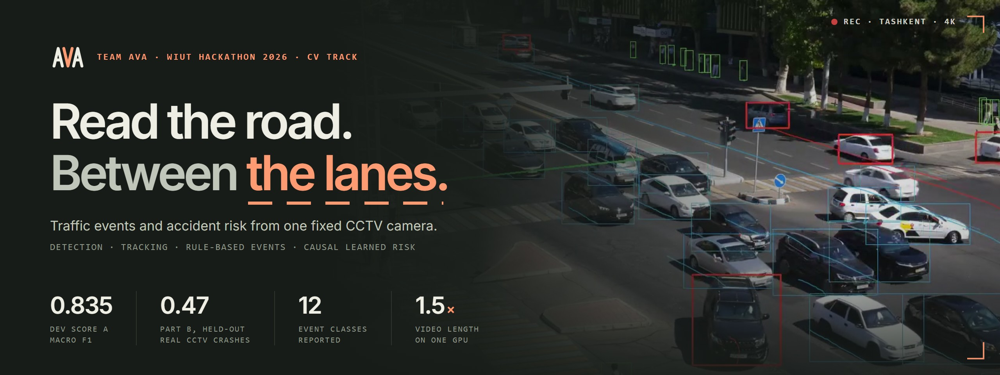

<p align="center"></p>

# AVA — WIUT Hackathon 2026, CV track

Traffic-event detection (Part A) and causal accident anticipation (Part B) for the fixed
4K CCTV camera of the elimination task.

* `solution.py` — the interface the organizers' harness imports (`CLASSES`, `detect_events`, `RiskEstimator`).
* `run_submission.py`, `evaluate.py` — the starter-kit harness and metric, **unchanged**.
* Website: **https://therizaev-ava.static.hf.space** · live demo server: **https://therizaev-ava-demo.hf.space** (see [Website and live demo](#website-and-live-demo)).

## Install and run

```bash
pip install -r requirements.txt          # Python 3.10+, CUDA GPU recommended (T4-class is enough)
bash weights/download.sh                 # only if weights/ is missing files; needs internet once
python run_submission.py --videos /data/test --out predictions.json
python evaluate.py --pred predictions.json --validate-only
```

All weights ship in `weights/` (`yolo26l.pt` 53 MB, `yoloe26l_hazards.pt` 79 MB; `yolo26s.pt`
20 MB is only used by the demo). Nothing is downloaded at run time: `src/__init__.py` sets
`YOLO_OFFLINE=1` and `YOLO_AUTOINSTALL=False` before Ultralytics is imported. `ffmpeg` is **not**
required by the submission (decoding uses PyAV's bundled FFmpeg); only the website renderer uses it.

Runtime of the official harness on the sample videos (RTX 2060 Super, i5-12400F, 6 cores):

| video | duration | Part A | total (A + B) | × duration |
|---|---|---|---|---|
| C3896 | 340 s | 187 s | 512 s | 1.50 |
| C3897 | 318 s | 182 s | 485 s | 1.53 |
| C3902 | 318 s | 163 s | 481 s | 1.51 |
| C3905 | 128 s | 63 s | 187 s | 1.46 |

The budget is 3× the duration; about 0.6× of Part B is the harness itself decoding every 4K
10-bit frame with OpenCV. `predictions_samples.json` is the output of exactly this run.

## Approach

```
.mp4 (4K H.264 High 4:2:2 10-bit)
  └─ PyAV decode, reference frames only (≈10 fps), straight to 1920×1080   [background thread]
      └─ YOLO26-L (COCO) FP16, imgsz 1280, batch 8  →  ByteTrack
      └─ every 5 s: SIFT + RANSAC registration to the reference frame (lighting bank)
      └─ every frame: signal-lamp sampling      └─ every 1 s: YOLOE-26L hazard / crash prompts
  └─ tracks in reference coordinates + signal phase timeline + hazard detections
      └─ rule-based event detectors  →  same-class merge  →  [[start, end, label], ...]
```

**Decoding.** The camera writes 4K H.264 High 4:2:2 10-bit at ~147 Mb/s, which NVDEC cannot
decode, so decoding runs on the CPU and is the most expensive step. We decode only the
reference frames of the IBBP GOP (`skip_frame=NONREF`: every 3rd frame, ≈10 fps) and let swscale
convert directly to 8-bit 1920×1080 (`src/video.py`). Decoding runs in a thread that overlaps
with GPU inference (`src/detection.py`).

**Detection and tracking.** Ultralytics YOLO26-L pre-trained on COCO (people, bicycles, cars,
motorcycles, buses, trucks, animals), FP16, confidence 0.10 for ByteTrack's two-stage association.
Tracks are cut where the box jumps (id switches) (`src/tracks.py`).

**Scene layout and registration** (`src/scene.py`, `assets/`). The layout is drawn once in the
coordinates of a reference frame (the median background of sample C3896): approach and outbound
carriageways, median, islands, three zebra crossings, the approach stop line, the solid lane
dividers before the stop line, and the traffic-signal lamps. The camera is re-mounted between
recordings (shifts up to ~60 px) and drifts ~10 px during the first half-minute of a clip, so
every 5 s the current frame is registered with SIFT + RANSAC against a bank of three median
backgrounds (noon, evening sun, dusk) whose homographies to the reference are known; a failed or
implausible fit keeps the previous one. All rules work in reference coordinates.

**Learned scene statistics** (`scripts/build_scene_maps.py`, `assets/flow.npz`): the dominant
motion direction of vehicles in every 16-px cell, from all sample tracks (used for wrong-way
driving), and the lane positions: the main road's lane lines are rays from its vanishing point,
so the angle of a ground point seen from that point is a perspective-free lane coordinate; the
valleys of its histogram over all sample tracks give the dividers as vehicles see them.

**Traffic signal** (`src/signals.py`). The approach only shows us the backs of its signals; the
visible 3-lamp head on the median tip carries the main-road phase (verified: approach vehicles
start crossing the stop line ≈2 s after it turns green). Each lamp's colour activation is
normalised by its own off/on levels in the video, and gaps are resolved with the phase sequence
(flashing green, occlusion by buses, red+yellow = red). A pedestrian head in phase with the main
road confirms green in unreadable stretches. Cycle ≈ 75 s: red 36 s, green 36 s, yellow 3 s.

**Event rules** (`src/events/`), all in reference coordinates:

| class | rule |
|---|---|
| red_light | an approach vehicle's front (box bottom) crosses the stop line while the phase is red (0.5 s grace at both ends), then enters the junction; ends when it leaves the junction/frame |
| stop_line | an approach vehicle stops past the stop line (not beyond cw1) during red; ends at green |
| jaywalking | a pedestrian (riders / occupants removed by box overlap) on the carriageway more than 0.6 body heights (≥12 px) from the kerb and more than 0.15 body heights (≥10 px) from any zebra, for ≥1 s; boxes whose feet are hidden behind someone in front get an interpolated ground point, track fragments split by an occlusion are re-linked, and the event is extended back/forward to the kerb crossing (also across a short walk over an island tip); groups within 6 s are one event |
| failure_to_yield | a vehicle's footprint drives through a crossing while a pedestrian who is actually crossing (moved ≥55 px along the zebra within ±3 s, not standing at a refuge or kerb end) is on it within a quarter of the crossing's length of the vehicle's path |
| wrong_way | a moving vehicle heading against a strongly one-way cell of the learned flow field for ≥2 s and ≥100 px |
| illegal_u_turn | approach → around the median tip → outbound (origin/destination on the layout) |
| solid_line_crossing | the lane coordinate crosses a solid divider before the stop line: seen clear of the line in the old lane (not already straddling it), then settled in the new lane; start = the side reaches the line, end = fully in the new lane |
| stopped_vehicle | stationary ≥10 s next to the roadside kerb (not next to the median or an island, where turners wait; the car-park apron by cw2 is off the road) while traffic keeps passing it; pieces of one vehicle linked across id switches; not a signal queue |
| road_obstacle / fire_smoke | open-vocabulary YOLOE-26L (text prompts baked into the weights) every second, on the carriageway, not covered by a tracked road user, seen at one place for ≥4 s |
| accident | the YOLOE "crashed car" prompt (conf ≥ 0.45) in ≥2 consecutive samples at one place on the carriageway; the event is the 3 s around the first hit (see [Validation on real accident footage](#validation-on-real-accident-footage) and [Ablations](#ablations)) |
| near_miss | hard braking with a road user in the path (not reported, see `dev/decisions.md`) |

Same-class segments are merged (simultaneous events of one class are one segment, as in the
ground truth) and clipped to the video duration.

**Part B** (`src/risk.py`). A causal estimator: the same detector at imgsz 960 on every 3rd frame
(fixed stride → deterministic), an online ByteTrack and periodic registration. Cues computed only
from the past: crossing-path conflicts (earliest future overlap of road-user footprints),
same-lane rear-end closing (lane identity from the vanishing-point angle), pedestrian conflicts on
the carriageway, hard braking. Cues are combined as independent evidence, smoothed with a
fast-attack / slow-release filter, and mapped by a monotone calibration (which keeps the ranking,
hence AP) so that the evidence level giving ~0.2 false alarms per minute on the sample videos
becomes the 0.5 alarm threshold. An alarm counts only if it starts before the contact, so a second,
unsmoothed branch raises the score to 0.75 at once when two vehicles closing at ≥300 px/s will touch
within 0.4 s (in two consecutive analysed frames); it adds no false alarm on the sample videos and
doubles the crashes alarmed in time on real footage (below). This hand-made estimate is the
fallback; the output comes from a learned layer on top of it (`src/risk_model.py`). Per analysed
frame it computes 20 scale-free features: the cues and the imminent-contact flag; time to contact
and minimum gap of vehicle pairs under constant velocity and under constant acceleration; proximity
and time to contact between pedestrians or two-wheelers and moving cars; proximity, closing speed,
yaw rate, acceleration, hard deceleration and sideways acceleration in box widths; speed; numbers of
moving vehicles and people. Five small networks read them with their max over the last 1 s and 3 s
and their deviation from the 3-s mean; five causal temporal convolutions (dilations 1–16, 63 analysed
frames ≈ 6 s) read their recent history directly. The averaged probability that a crash follows
within 5 s is smoothed (fast attack, slow release) and calibrated so that the lowest level raising
no false alarm on held-out sample videos becomes 0.5; once an alarm starts, a new one cannot start
for 10 s (repeat alarms on one incident). It was trained on 200 real CCTV crashes we timed plus
ordinary traffic (`dev/external/risk_model_cv.md`). Part B never reads the video file and never
uses Part A output.
On footage from another camera (no registration ever succeeds) the layout is not used: every road
user counts as on the road and "same lane" becomes a lateral-offset test. A track whose box jumps
(id switch, cut) restarts its history, and "braking" of most fast vehicles in the same instant is
treated as a frozen frame, not as braking.

### Learned vs rule-based

* **Learned (pre-trained, not fine-tuned by us):** YOLO26-L / YOLO26-S detectors (COCO), YOLOE-26L
  open-vocabulary detector with MobileCLIP text embeddings (used offline to bake the prompts).
* **Trained by us:** the Part B anticipation layer (5 networks with 16 hidden units on 80 context
  features + 5 causal temporal convolutions on the 20 per-frame kinematic features, trained on 200
  timed third-party CCTV crashes + ordinary traffic; `scripts/train_risk_model.py --stack 5`).
* **Estimated from our own unlabeled sample videos:** flow field, lane positions, lighting bank,
  signal lamp positions, the Part B alarm calibration.
* **Rule-based:** registration, signal-phase logic, all event detectors, segment post-processing.

### Models and datasets (licences)

| item | source | licence |
|---|---|---|
| YOLO26-L, YOLO26-S, YOLOE-26L weights | Ultralytics | AGPL-3.0 |
| COCO (training data of the above, not used directly) | cocodataset.org | CC BY 4.0 (annotations) |
| MobileCLIP text encoder (offline, to bake the YOLOE prompts) | Apple / Ultralytics | see Ultralytics |
| TAD benchmark (third-party CCTV accident clips; trains and validates the Part B network, not redistributed) | Xu et al., "TAD: A Large-Scale Benchmark for Traffic Accidents Detection From Video Surveillance", IEEE Access 13, 2025 ([repo](https://github.com/UnicomAI/UnicomBenchmark/tree/main/TADBench)) | released for research use, citation requested; no explicit licence |

The detectors are used as released. One small model is trained by us: the Part B layer
(`scripts/train_risk_model.py`, `assets/risk_model.json`), on the TAD clips with our own crash
timings (277 accident clips timed, `dev/external/tad_labels.json`) plus the four sample videos as
ordinary traffic. TAD also validates the accident rule and set two timing constants of it
(`CRASH_BEFORE`, `CRASH_AFTER`). The dev labels of the four sample videos (`dev/labels.json`) are
our own annotations.

## Results on the sample videos (our dev labels)

`python scripts/export_metrics.py --gt dev/labels.json --pred predictions_samples.json`
(the official `evaluate.py` on the harness output, all four videos end to end). Every class that
occurs in the labels counts, as in the official Score A.

| class | F1@0.3 | F1@0.5 | F1@0.7 | mean | TP/FP/FN@0.5 |
|---|---|---|---|---|---|
| red_light | 1.00 | 1.00 | 1.00 | **1.00** | 1/0/0 |
| stop_line | 1.00 | 1.00 | 1.00 | **1.00** | 5/0/0 |
| stopped_vehicle | 1.00 | 1.00 | 1.00 | **1.00** | 4/0/0 |
| congestion | 0.89 | 0.89 | 0.89 | **0.89** | 4/1/0 |
| illegal_turn | 1.00 | 1.00 | 0.60 | **0.87** | 5/0/0 |
| jaywalking | 0.85 | 0.85 | 0.60 | **0.77** | 17/4/2 |
| solid_line_crossing | 0.93 | 0.53 | 0.40 | **0.62** | 4/4/3 |
| failure_to_yield | 0.69 | 0.51 | 0.42 | **0.54** | 17/19/14 |

**Score A = 0.835** (micro F1@0.3/0.5/0.7 = 0.82/0.71/0.57). The sample videos contain no accident,
so Part B cannot be scored on them; its alarm threshold is calibrated to at most ~0.2 false alarms
per minute of ordinary traffic: the harness output above raises one alarm in the 18.4 min of sample
traffic (C3896 at 70 s, peak 0.53; elsewhere the risk stays below 0.48). See also [Validation on real accident footage](#validation-on-real-accident-footage).

Reported classes: red_light, stop_line, jaywalking, failure_to_yield, wrong_way, stopped_vehicle,
solid_line_crossing, illegal_turn, congestion, road_obstacle, fire_smoke, accident. wrong_way,
road_obstacle, fire_smoke and accident do not occur in the samples, and their rules fire nowhere on
them (so they cannot add a false class there). Detected but not reported:
illegal_u_turn (frequent and not visibly prohibited) and near_miss (every candidate rejected on
inspection) — see `dev/decisions.md`.

The dev labels (`dev/labels.json`, 18.4 min, 76 events) were made with the protocol in
`dev/README.md`: a blind sweep, an independent re-check of every event, and a third check of every
detector event the labels did not contain (which added 14 events the first pass had missed).

## Ablations

`python scripts/ablations.py` re-runs the Part A analysis pass on the four samples with one setting
changed and scores the same rules with the official `evaluate.py` on our dev labels
(`dev/ablations.json`; also on the website):

| variant | Score A | micro F1@0.5 | analysis time (× video) |
|---|---|---|---|
| YOLO26-L · 1280 px · 10 fps **(submitted)** | 0.835 | 0.71 | 0.48× |
| YOLO26-M · 1280 px · 10 fps | 0.788 | 0.67 | 0.44× |
| YOLO26-S · 1280 px · 10 fps | 0.748 | 0.63 | 0.43× |
| YOLO11-L · 1280 px · 10 fps | 0.802 | 0.68 | 0.47× |
| YOLO26-L · 960 px · 10 fps | 0.765 | 0.64 | 0.43× |
| YOLO26-L · 1280 px · 5 fps | 0.775 | 0.66 | 0.42× |

* The large detector at full input size and 10 fps is worth its cost: every cheaper setting loses
  0.03–0.09 of Score A, mostly on the pedestrian classes and on lane changes, and saves little
  time, because decoding the 4K 10-bit stream on the CPU dominates the analysis pass.
* Halving the frame rate is the worst trade: tracks break and speeds get noisy.
* The ablations exposed a real risk: with any of the cheaper settings, the old kinematic accident
  branch (an abrupt stop next to another road user) and a 1-s wrong-way test fired on ordinary
  traffic, and a class the test set may not contain costs a whole class of macro F1 (Score A
  0.70/0.66/0.68/0.62 for M/S/960 px/5 fps before the fix). The kinematic branch had found none of
  the 36 real crashes either, so it was dropped, and wrong_way now needs 2 s and 100 px; the
  submitted configuration is unchanged by both fixes.
* Class confusion (`python scripts/confusion.py`, `dev/confusion.json`): of 66 labelled events matched
  at tIoU ≥ 0.3 regardless of class, none gets the wrong class; the errors are misses (10) and false
  alarms (19), most of them failure_to_yield.

## Validation on real accident footage

The sample videos contain no accident, so Part B and the accident rule were checked on the public
TAD benchmark (CCTV/surveillance clips, mostly Chinese highways and streets, many of them edited
news clips with cuts, zooms and replays). TAD only labels whole clips, so we timed the first contact
ourselves in all 277 accident clips (`dev/external/tad_labels.json`): 200 show the collision, 67 only
its aftermath, 9 are compilations of several crashes (excluded). Part B is cross-validated on all
200 crashes and 127 accident-free clips; the accident rule was checked on the first 36 crashes and
40 accident-free clips.
`python scripts/ext_cache.py <clips> && python scripts/eval_external.py --accident-rule`
(the official `evaluate.py` on a causal replay of Part B, see `dev/external/tad_eval.json`):

| | result on TAD |
|---|---|
| Part B, Score_B (held-out clips, 5-fold, alarm point set on the target camera) | **0.47** with the learned layer (AP 0.34, alarm F1 0.70, mTTA 2.8 s) — 0.36 with our first single network, 0.12 with the hand-made cues alone, 0.02 before the imminent-contact branch |
| accident rule, F1 @ tIoU 0.3 / 0.5 / 0.7 (36 crashes, 40 normal clips) | **0.36 / 0.22 / 0.11** (before the crash-prompt branch: 0 / 0 / 0) |

What we learned:

* **Anticipation does not transfer.** None of the kinematic cues (crossing TTC, same-lane closing,
  proximity, yaw rate, acceleration, speed) ranks the 5 s before a TAD crash above ordinary
  traffic (chance-normalised AP ≈ 0 for each). The conflict cue does rise, but only ~0.1 s before
  contact. Most TAD crashes come from a sudden manoeuvre (swerve, cut-in, a rider darting out)
  that constant-velocity extrapolation cannot foresee, and the edited clips break tracking. What
  does help is alarming at the last moment: the imminent-contact branch catches 4 of the 36 crashes
  before contact with 40 % of its alarms right, without new false alarms on the sample traffic.
* **A learned combination does anticipate.** With 200 timed crashes (we timed all 277 TAD accident
  clips), a small network on the same kinematic features ranks the 5 s before a crash clearly above
  ordinary traffic (AP 0.22 on held-out clips vs ≈ 0 for any single feature) and, with the alarm
  point set on our own camera, raises Score_B on held-out TAD clips from 0.12 to 0.36 with alarms
  ~2.7 s before contact. Seven more features (constant-acceleration time to contact, pedestrians and
  two-wheelers near moving cars, braking and swerving), temporal convolutions over the last ~6 s,
  an ensemble, reporting the learned score alone and a 10-s pause between alarms raise it to 0.47
  (`dev/external/risk_model_cv.md`). Caveat: TAD clips are cut around the crash (contact a median
  3.8 s after the first frame), so part of any learned gain comes from the clip start; with the
  first ~6 s of every clip removed the layer scores 0.31 against 0.24 for the first network.
* **More crash data did not help.** Adding SO-TAD (540 clips) or ACCIDENT (429 crash clips) to
  training only, with the same held-out TAD evaluation, lowered Score_B to 0.39 and 0.30–0.35. In
  SO-TAD the crash clips show emptier streets than its normal clips (the model learns scene density);
  ACCIDENT has crash clips only (the camera type becomes a crash cue). The shipped model is trained
  on TAD alone; these two datasets are not used.
* **Detection does transfer, from appearance.** The kinematic accident rule needs a vehicle to stop
  abruptly and stay stopped; on real footage the boxes of crashing vehicles are lost or switch ids,
  so it found none of the crashes. An open-vocabulary "crashed car" prompt on the YOLOE hazard pass
  finds 17 of the 36 crashes, shortly after contact (it also fires on 2 of the 40 accident-free TAD
  clips), and never reaches 0.4 on the 18 minutes of sample traffic (the rule needs ≥ 0.45 in two
  consecutive samples at one place). It is now the accident rule (the kinematic branch was dropped, see [Ablations](#ablations)).

## Reproducibility

* Seeds are fixed (`src/pipeline.py`: Python, NumPy, torch, cuDNN deterministic mode); two runs
  on the same machine produce identical events (`python scripts/check_determinism.py samples/C3905.MP4`).
* Part B processes a fixed frame stride (no time-based skipping), so its curve is deterministic too.
* Non-determinism left: FP16 GPU arithmetic can differ in the last bits between GPU models.
* `predictions_samples.json` is our output on the sample videos with the command above.

To rebuild the learned assets from the sample videos:

```bash
python scripts/make_backgrounds.py samples --out work/bg      # median backgrounds + registration
python scripts/extract_tracks.py samples --out work/tracks    # (or analyze_samples.py for full caches)
python scripts/build_scene_maps.py --tracks work/tracks       # flow field, occupancy maps
python scripts/make_hazard_weights.py                         # YOLOE hazard weights (internet once)
```

## Repository layout

```
solution.py, run_submission.py, evaluate.py, requirements.txt, predictions_samples.json
src/            pipeline code (video, detection, scene, signals, tracks, events/, risk, hazards, render)
assets/         reference frame, lighting bank, layout.json, flow.npz
weights/        model weights + download.sh
scripts/        EDA, dev tooling, asset builders, site data builder
dev/            our labels of the sample videos + evaluation reports
demo/           FastAPI live-demo server
website/        static website (served by the demo server)
docs/           README banner
deploy/         Hugging Face Space cards: static site (`hf_space_static/`) and site + demo (`hf_space/`, Dockerfile, CPU requirements)
```

## Website and live demo

```bash
pip install -r requirements.txt -r demo/requirements.txt
uvicorn demo.app:app --host 0.0.0.0 --port 7860      # site + upload demo at http://localhost:7860
```

The public site is the static Hugging Face Space [TheRizaev/AVA](https://huggingface.co/spaces/TheRizaev/AVA),
served at **https://therizaev-ava.static.hf.space**. Its demo section talks to the demo server, the
Docker Space [TheRizaev/AVA-demo](https://huggingface.co/spaces/TheRizaev/AVA-demo) at
**https://therizaev-ava-demo.hf.space** (built from `deploy/hf_space/`: Dockerfile with CPU-only torch
and ffmpeg, Space card; it also serves the whole site itself). The site stays up even when the demo
server sleeps; the demo server sleeps after 48 h without visitors and wakes on the next visit in 2–3 min.

```bash
pip install huggingface_hub && hf auth login                    # a token with write access
python scripts/build_space.py --upload <user>/<demo-space>       # website + live demo (Docker; PRO account)
python scripts/build_space.py --static --demo-api https://<user>-<demo-space>.hf.space/api --upload <user>/<space>
```

The demo accepts `.mp4`/`.mov` up to 150 s and 400 MB and shows progress while it runs; on CPU it uses
YOLO26-S at 960 px (the submission itself uses YOLO26-L at 1280 px on the GPU), at the same ≈10 fps, and skips the
open-vocabulary hazard pass.

## Team

**AVA** — Tashkent Branch of Lomonosov Moscow State University.

| member | role | built for this project |
|---|---|---|
| [Goldengorin Vitaliy Borisovich](https://github.com/vbgoldengorin) (captain) | Mathematical Modelling & Statistical Analysis | Team lead: the plan, the task split and the submission package.<br>Evaluation design: the dev-set protocol (blind sweep, independent re-check, third check of detector candidates) and which classes to report under macro F1.<br>Part B risk model: conflict cues (time to collision of footprints, same-lane closing, pedestrian conflict, hard braking), the smoothing and the calibration to a false-alarm budget; validation on real CCTV crashes we timed in the TAD benchmark.<br>Ablations and error analysis: detector, input size and frame rate against Score A and runtime; class confusion. |
| [Rizaev Amirkhan Shavkatovich](https://github.com/TheRizaev) | ML Engineer & Data Analyst | Detection and tracking pipeline: YOLO26 + ByteTrack, decoding only the reference frames of the 4K 10-bit stream, batching and the time budget.<br>EDA of the sample videos: lighting, object counts, motion and flow fields, lane positions, traffic signal cycle.<br>Open-vocabulary hazard and crash detector (YOLOE with baked text prompts) and its validation on public accident footage.<br>This website and the live demo (FastAPI server, Hugging Face Space). |
| [Gayratov Amirkhon Sherzodovich](https://github.com/AmirGairatov) | Computer Vision Engineer | Scene geometry: registration of every clip to a reference frame (SIFT + RANSAC against a lighting bank), the hand-drawn layout and the vanishing-point lane coordinate.<br>Traffic-signal phase reader from the lamps of the vehicle signal head.<br>Event rules: red-light, stop-line, jaywalking, failure to yield, solid-line crossing, illegal turn, stopped vehicle, congestion.<br>Annotated renders of every sample video (boxes, trajectories, event timeline, risk curve). |

## Acknowledgements

Ultralytics (YOLO26, YOLOE, ByteTrack implementation), PyAV / FFmpeg, OpenCV.
